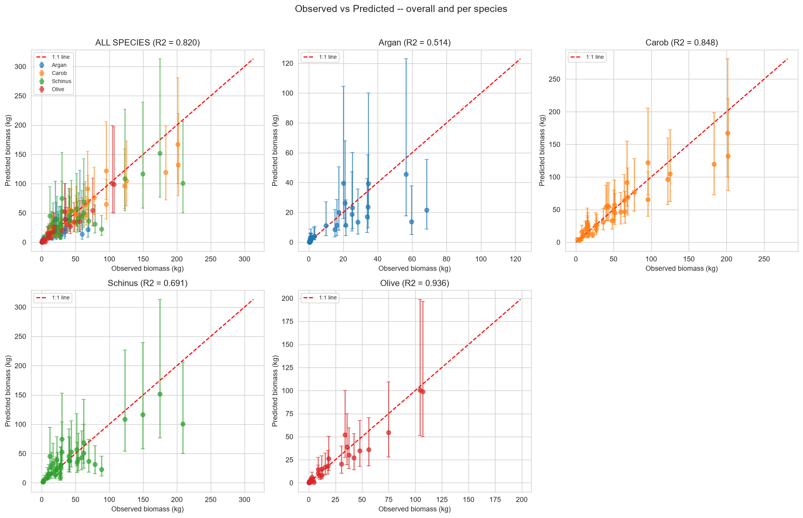
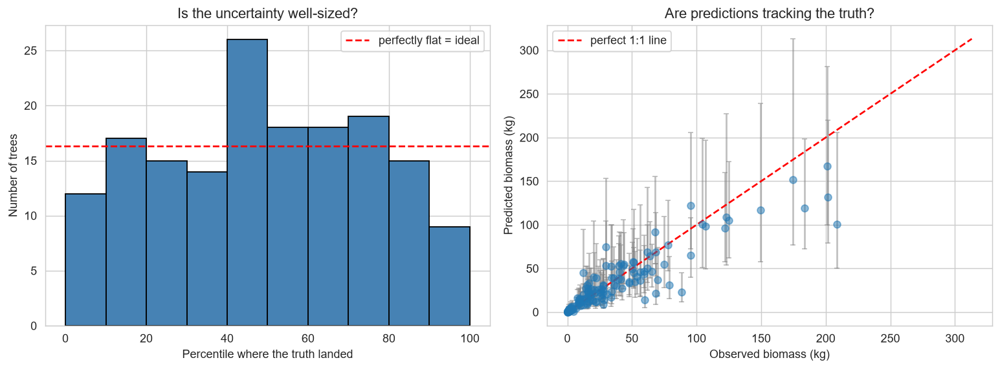
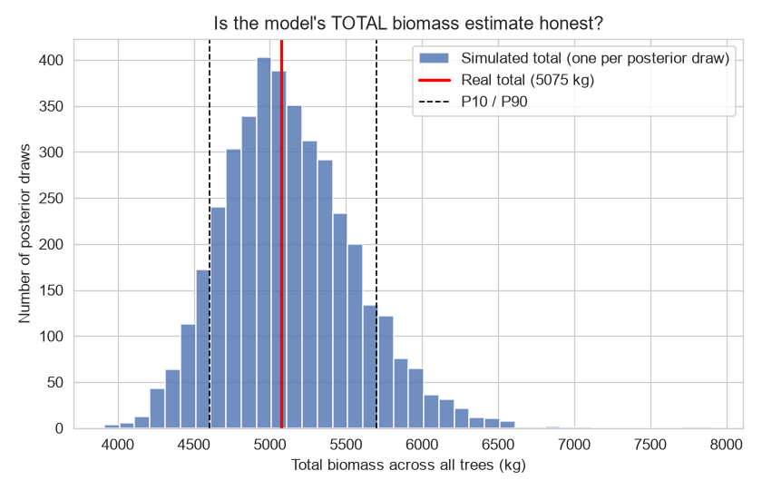
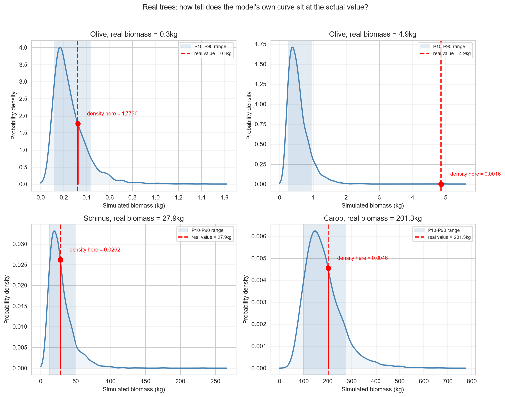
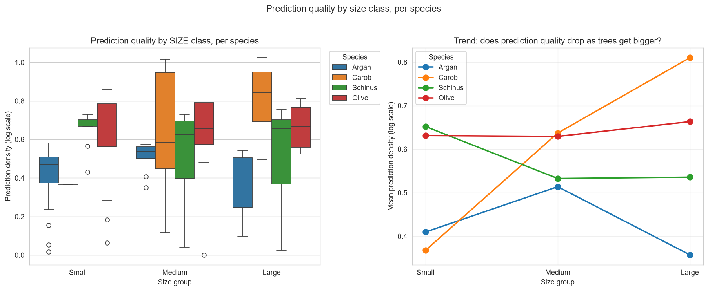
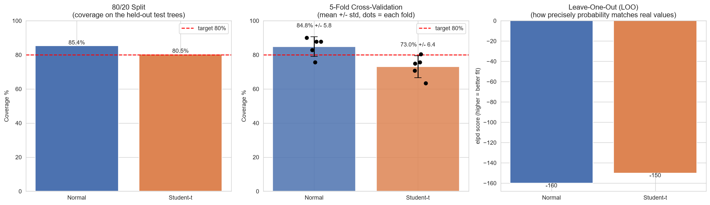

# BRAMBLE Model Report

A hierarchical Bayesian model predicting tree biomass (kg) from height (Ht), crown
diameter (CD) and basal diameter (BD), fit separately per species but sharing statistical
strength across species (partial pooling), with species-specific residual noise. This report
walks through what was built, how it was checked, and what the results actually mean -- not
just the numbers, but why each check exists.

## 1. Data
- Total trees: 204
- Species: Argan, Carob, Schinus, Olive
- Predictors: Ht, CD, BD
- Train / test split: 163 / 41 trees (80/20, stratified by species
  so each species keeps its own proportion in both sets)

## 2. Model

    log(biomass) = beta0_species + b1_species*log(Ht) + b2_species*log(CD) + b3_species*log(BD) + error_species

Biomass grows with size roughly as a power law, so fitting on the log scale turns that curve
into a straight line. Each species gets its own intercept and slopes, but those coefficients
are drawn from a shared population-level distribution -- species with fewer trees (Argan)
borrow statistical strength from the others instead of being fit in isolation. The noise term
(error_species) is also species-specific rather than shared, since different species have
genuinely different tree-to-tree variability. The model is fit with MCMC (NUTS sampler in
PyMC), using a non-centered parameterization, a numerical trick that only helps the sampler
converge and does not change what is being estimated.

## 3. Convergence (Step 7)
- Divergences: 13 (0 is ideal; a handful out of thousands of draws is not a concern)
- Max R-hat: 1.003 (target: as close to 1.00 as possible -- means the 4
  independent chains agree with each other)
- Min ESS: 1914 (effective sample size -- how many *independent*
  posterior draws the chains produced; higher is more precise)

These three numbers together say the sampler actually explored the posterior properly and the
fit can be trusted -- if any of them looked bad, nothing downstream would be reliable.

## 4. Overall + per-species performance (Step 9, training data)

**Overall (all species combined):** R2 = 0.820, RMSE = 17.59 kg,
CV% = 56.5%, Coverage = 87.1% (target ~80%).

An overall number can hide a species-specific weakness -- a few well-predicted species can
compensate for one badly-predicted one and the average would still look fine. The table below
splits the same predictions out by species:

| Species | R2 | RMSE | CV % | Coverage % | N trees |
| --- | --- | --- | --- | --- | --- |
| Argan | 0.51 | 12.93 | 86.80 | 85.30 | 34 |
| Carob | 0.85 | 20.26 | 37.70 | 86.80 | 38 |
| Schinus | 0.69 | 25.42 | 59.10 | 83.30 | 42 |
| Olive | 0.94 | 6.36 | 43.20 | 91.80 | 49 |

**Strongest fit:** Olive (R2 = 0.936). **Weakest fit:** Argan
(R2 = 0.514) -- see the known limitation at the end of this report.

## 5. Calibration check (Step 8)

Coverage tells us *how often* the real value lands inside the predicted P10-P90 range. The
P10-P90 range comes from simulating random tree-to-tree noise (drawn from each species' own
sigma) around each posterior draw's predicted mean -- this simulation, on its own, already
restores the correct average after exponentiating from the log scale, so no separate
bias-correction factor is applied on top of it (applying both would double-count the same
correction). The histogram below shows, for every tree, where its real value landed as a
percentile of its own simulated distribution -- if the model is well calibrated this should
scatter evenly across 0-100.

## 6. Held-out test set (Step 10)

Training-set calibration can look good partly because the model was fit on those exact trees.
The real test is trees the model never saw during fitting:
- R2: 0.790
- RMSE: 18.01 kg
- Coverage: 85.4% (target ~80%)

## 6b. Stand-level total biomass check

Individual-tree coverage can look fine on average while still being biased in one direction --
this check catches that. Every posterior draw's simulated biomass is summed across all trees
to get one possible TOTAL for the whole plot (correctly correlated, since every tree in a given
draw shares that draw's species-level parameters), giving a distribution of plausible totals.
The real field-measured total is then compared against that distribution.

- Real total biomass: 5074.7 kg
- Predicted total (P10-P90): 4604.7 - 5703.3 kg (median 5092.8 kg)
- Real total inside P10-P90? True
- Real total lands at percentile: 48.1 (50 = perfectly centered)

## 7. Per-tree prediction quality (Step 12)

Beyond one aggregate coverage number, this checks whether prediction quality depends on a
tree's size, age, or species. "Prediction density" here is how much probability mass the
model puts exactly on the tree's real value (computed on the log scale).

## 8. Normal vs Student-t likelihood comparison (Step 11)

| Likelihood | 80/20 Split -- Coverage % | 5-Fold CV -- Coverage % (mean +/- std) | Leave-One-Out -- elpd (+/- se) |
| --- | --- | --- | --- |
| Normal | 85.37 | 84.8 +/- 5.8 | -160 +/- 19 |
| Student-t | 80.49 | 73.0 +/- 6.4 | -150 +/- 15 |

**Verdict:** kept **Normal** -- decided on 5-fold CV coverage, the validation method least
sensitive to any single arbitrary split.

## 9. Known limitation / next step

**Argan** remains the weakest species (R2 = 0.514) even with Ht, CD and BD
together. Basal diameter was added specifically to help this species and improved its fit, but
did not fully close the gap. This is treated as a limitation of the available measurements for
this species rather than a flaw in the model itself, and further tuning specifically aimed at
this species' residual pattern was deliberately avoided to prevent overfitting to this one
dataset.
